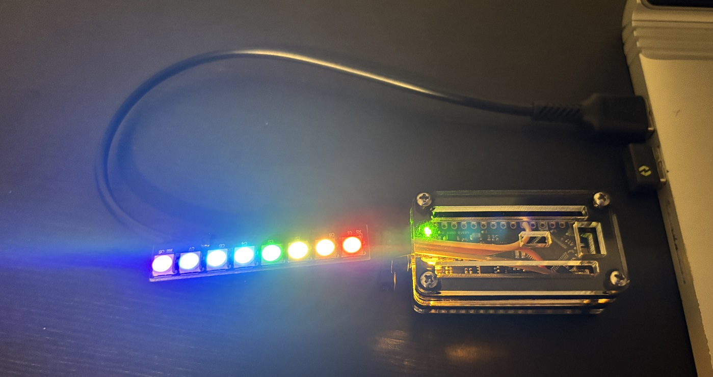

# LED-Workshop

## Overview
In this workshop, you will develop your fundamental Java skills by programming an LED (light-emitting diode) strip containing eight individually controllable RGB (red-green-blue) LEDs. The strip is wired to an Arduino microcontroller, which connects to a computer over USB. 

The goal is to write the code needed to produce the light patterns from the `patterns` folder as well and/or your own imagination.

<p align="center">
  
</p>


## Software Setup
### Part 1: Install developer tools
These tools are needed not just for this workshop but for any software development on the team. This part can be skipped if the tools are already installed.

##### 1a. WPILib
WPILib provides the Visual Studio Code editor and specific tools for programming an FRC robot.

Follow the instructions on the [WPILib Installation Guide](https://docs.wpilib.org/en/stable/docs/zero-to-robot/step-2/wpilib-setup.html) to download, mount, and install WPILib. Choose the following install options when prompted:
  * **Everything**
  * **Install for this User**
  * **Download for this computer only (fastest)**

##### 1b. Git
Git is a version control system that allows multiple developers to collaborate in the same code base.

[Download Git here](https://git-scm.com/install/). It's ok to use all the default options during the installation (they can be changed later if needed).

### Part 2: Prepare for LED Workshop
These steps are needed for the LED Workshop specifically.

##### 2a. Download and load in repository
  1. Open WPILib VS Code and click Terminal > New Terminal

  2. In the terminal that opens, enter the following to clone this Github repository:
   `git clone https://github.com/KHS-Robotics/LED-Workshop`
    A new folder called **LED-Workshop** should appear in your home directory (e.g. *C:\\Users\\<your name>* on Windows)
> **Note**: Alternatively, you can download the repository manually by clicking the green Code button on this Github page, selecting Download ZIP, then extracting the folder.
  3. Load the **LED-Workshop** folder into VS Code using one of these methods:
      * File > Open Folder
      * Drag and drop the folder into the editor
      * Enter `code LED-Workshop` in the terminal

##### 2b. Hello World
Create the file `LEDAnimator.java` from within the `src/main/java/ledcontrol/` folder and fill it with the following contents. This creates a LEDController object called "controller" and uses its "sendRGB" method to turn on a single LED.
```
package ledcontrol;
public class LEDAnimator {
    public static void main(String[] args) {
        LEDController controller = new LEDController();
        controller.sendRGB(0, 128, 0, 0);  // Turns the first LED red at 50% brightness
    }
}
```
Click on **Run** (the triangular play button) to execute the `main` function in `LEDAnimator.java`. If the Arduino is connected, you should see the first LED turn red. If it is not connected, you will see a message with *"Is the Arduino plugged in?"* in the terminal.


## Hardware Setup (Reference Only)

This section describes how the Arduino and LED strip hardware is configured.

### Materials
* [Arduino Nano Every](https://store-usa.arduino.cc/products/nano-every?srsltid=AfmBOooJA36aqjCzknBGI81Jtcyiwb-t4eUoDF8LCNA4oYXuugBOLtRx) microcontroller
* [LED Array](https://www.amazon.com/dp/B0BWH95XSH?ref=ppx_yo2ov_dt_b_fed_asin_title) (8x WS2812B 5050 RGB LED Stick)
* [Jumper cable](https://www.amazon.com/dp/B0BKZRGF6N?ref=ppx_yo2ov_dt_b_fed_asin_title) (3x wires needed)
* [USB Cable](https://www.amazon.com/dp/B095JZSHXQ?ref=ppx_yo2ov_dt_b_fed_asin_title&th=1) (USB A to Micro USB)
* (optional) [Arduino Nano Case](https://www.amazon.com/dp/B0916HNSXQ?ref=ppx_yo2ov_dt_b_fed_asin_title)

### Wiring
The LED array is connected to the Arduino with three wires:
| Arduino | LED Strip | Description | 
| ------- | --------- |------------ |
| 5V      | +5V       | Power       | 
| GND     | GND       | Ground      |
| D3      | DI        | Data In     |

The arduino can power the LEDs from a standard USB connection to a computer. No additional power supply is needed.

### Firmware
The Arduino Nano Every requires firmware to process commands sent by the computer over USB and power each LED appropriately. It should be flashed using the official [Arduino IDE](https://www.arduino.cc/en/software/) with the [MegaAVR Boards Core]( https://docs.arduino.cc/software/ide-v1/tutorials/getting-started/cores/arduino-megaavr/). The sketch to upload is located in this repository at `src/Arduino/PixelDriver/PixelDriver.ino`.